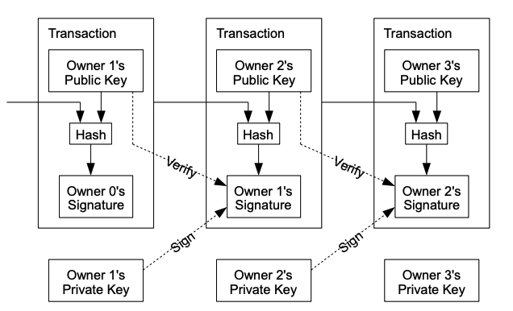

# 比特币：一种点对点的电子现金系统

作者：中本聪​ satoshin@gmx.com​ www.bitcoin.org​ 2008.10.31

**摘要：** 一种纯粹的点对点电子现金版本将允许在线支付直接从一方发送到另一方，而无需通过金融机构。数字签名提供了部分解决方案，但如果仍然需要一个可信的第三方来防止双重支付，主要的好处就会丧失。我们提出了一种使用点对点网络解决双重支付问题的方法。网络通过将交易哈希到一个持续的基于哈希的工作量证明链中来为交易打上时间戳，形成一个无法在不重新进行工作量证明的情况下更改的记录。最长的链不仅作为见证事件顺序的证明，还证明它来自最大的 CPU 算力池。只要大多数 CPU 算力由不合作攻击网络的节点控制，他们将生成最长的链并超过攻击者。网络本身需要的结构最小。消息以尽力而为的方式广播，节点可以随意离开和重新加入网络，接受最长的工作量证明链作为他们离开期间发生的事情的证明。

## 1. 引言
互联网上的商业几乎完全依赖金融机构作为可信的第三方来处理电子支付。虽然该系统对于大多数交易来说运作良好，但它仍然存在基于信任模型的固有弱点。完全不可逆的交易实际上是不可能的，因为金融机构无法避免调解争议。调解的成本增加了交易成本，限制了最小的实际交易规模，并切断了小额随意交易的可能性，并且在失去进行不可逆支付的能力方面存在更广泛的成本。由于可能的逆转，信任的需求扩散开来。商家必须对他们的客户保持警惕，要求比他们通常需要的更多的信息。某种程度的欺诈被认为是不可避免的。这些成本和支付的不确定性可以通过使用实物货币在面对面交易中避免，但没有机制可以在没有可信方的情况下通过通信渠道进行支付。

需要的是一种基于加密证明而不是信任的电子支付系统，允许任何两个愿意的当事人直接进行交易，而无需可信的第三方。计算上不可能逆转的交易将保护卖家免受欺诈，并且可以轻松实施常规的托管机制来保护买家。在本文中，我们提出了一种使用点对点分布式时间戳服务器生成交易时间顺序计算证明的解决方案。只要诚实节点集体控制的 CPU 算力超过任何合作攻击节点组的算力，系统就是安全的。

## 2. 交易
我们将电子币定义为一串数字签名。每个所有者通过数字签名前一个交易的哈希和下一个所有者的公钥并将这些添加到币的末尾来将币转移给下一个所有者。收款人可以验证签名以验证所有权链。



当然，问题在于收款人无法验证某个所有者是否没有双重支付该币。一个常见的解决方案是引入一个可信的中央权威或铸币机构来检查每笔交易是否存在双重支付。在每次交易后，币必须返回铸币机构以发行新币，并且只有直接从铸币机构发行的币才被信任不会被双重支付。这个解决方案的问题在于整个货币系统的命运取决于运行铸币机构的公司，每笔交易都必须通过他们，就像银行一样。

我们需要一种方法让收款人知道前一个所有者没有签署任何早期的交易。对于我们的目的，最早的交易是最重要的，所以我们不关心后来的双重支付尝试。确认交易不存在的唯一方法是了解所有交易。在基于铸币机构的模型中，铸币机构了解所有交易并决定哪个交易先到达。为了在没有可信方的情况下实现这一点，交易必须公开宣布 [1]，我们需要一个系统让参与者就接收顺序的单一历史达成一致。收款人需要证明在每次交易时大多数节点同意它是第一个接收到的。

## 3. 时间戳服务器
我们提出的解决方案从时间戳服务器开始。时间戳服务器通过对要时间戳的项目块进行哈希并广泛发布哈希（例如在报纸或 Usenet 帖子中）来工作 [2-5]。时间戳证明数据在显然必须存在的时间内存在，以便进入哈希。每个时间戳在其哈希中包括前一个时间戳，形成一个链，每个额外的时间戳加强之前的时间戳。


## 4. 工作量证明
为了在点对点基础上实现分布式时间戳服务器，我们需要使用类似于 Adam Back 的 Hashcash [6]的工作量证明系统，而不是报纸或 Usenet 帖子。工作量证明涉及扫描一个值，当哈希（例如使用 SHA-256）时，哈希以一定数量的零位开始。所需的平均工作量在所需的零位数量上是指数级的，可以通过执行单个哈希来验证。

对于我们的时间戳网络，我们通过在块中递增一个随机数，直到找到一个值，使块的哈希具有所需的零位来实现工作量证明。一旦 CPU 努力使其满足工作量证明，块就不能在不重新进行工作的情况下更改。随着后续块的链接，改变块的工作将包括重新进行其后的所有块的工作。


工作量证明还解决了在多数决策中确定代表性的问题。如果多数基于一个 IP 地址一票，任何能够分配多个 IP 的人都可以颠覆它。工作量证明本质上是一个 CPU 一票。多数决策由最长的链表示，该链具有最大的工作量证明努力。如果大多数 CPU 算力由诚实节点控制，诚实链将增长最快并超过任何竞争链。要修改过去的一个块，攻击者必须重新进行该块及其后的所有块的工作，然后赶上并超过诚实节点的工作。我们稍后将展示，随着后续块的增加，较慢的攻击者赶上的概率呈指数级下降。

为了补偿硬件速度的增加和随时间变化的运行节点的兴趣，工作量证明难度由移动平均值确定，目标是每小时的平均块数。如果生成速度太快，难度会增加。

## 5. 网络
运行网络的步骤如下：

1) 新交易广播到所有节点。
2) 每个节点将新交易收集到一个块中。
3) 每个节点致力于为其块找到一个困难的工作量证明。
4) 当一个节点找到工作量证明时，它将块广播给所有节点。
5) 节点仅在块中的所有交易有效且未被花费时才接受该块。
6) 节点通过使用已接受块的哈希作为前一个哈希来创建链中的下一个块来表示对该块的接受。
节点总是认为最长的链是正确的，并将继续努力扩展它。如果两个节点同时广播下一个区块的不同版本，一些节点可能会先收到其中一个。在这种情况下，它们会在收到的第一个版本上工作，但会保存另一个分支，以防它变得更长。当找到下一个工作量证明并且一个分支变得更长时，平局将被打破；在另一个分支上工作的节点将切换到更长的分支。

新的交易广播不一定需要到达所有节点。只要它们到达许多节点，它们很快就会进入一个区块。区块广播也能容忍丢失的消息。如果一个节点没有收到一个区块，它将在收到下一个区块并意识到错过了一个时请求它。

## 6. 激励
按照惯例，区块中的第一个交易是一个特殊交易，它启动一个由区块创建者拥有的新币。这为节点支持网络提供了激励，并提供了一种将币初始分发到流通中的方式，因为没有中央机构来发行它们。恒定数量的新币的稳定增加类似于金矿工花费资源将黄金加入流通。在我们的情况下，消耗的是 CPU 时间和电力。

激励也可以通过交易费用来资助。如果交易的输出值小于其输入值，差额就是交易费用，它被添加到包含该交易的区块的激励值中。一旦预定数量的币进入流通，激励可以完全转变为交易费用，从而完全没有通货膨胀。

激励可能有助于鼓励节点保持诚实。如果一个贪婪的攻击者能够组装比所有诚实节点更多的 CPU 力量，他将不得不在使用它来欺诈人们以窃取回他的付款或使用它来生成新币之间做出选择。他应该发现遵循规则更有利可图，这些规则使他比其他所有人加起来获得更多的新币，而不是破坏系统和他自己财富的有效性。

## 7. 回收磁盘空间
一旦一个币的最新交易被足够多的区块掩埋，之前的已花费交易可以被丢弃以节省磁盘空间。为了在不破坏区块哈希的情况下实现这一点，交易被哈希在一个默克尔树中 [7][2][5]，只有根包含在区块的哈希中。旧区块可以通过截断树的分支来压缩。内部哈希不需要存储。


一个没有交易的区块头大约为 80 字节。如果我们假设每 10 分钟生成一个区块，80 字节 * 6 * 24 * 365 = 每年 4.2MB。随着计算机系统在 2008 年通常以 2GB 的 RAM 出售，并且摩尔定律预测当前每年增长 1.2GB，即使区块头必须保存在内存中，存储也不应该是问题。

## 8. 简化支付验证
可以在不运行完整网络节点的情况下验证支付。用户只需要保留最长工作量证明链的区块头副本，他可以通过查询网络节点直到确信他拥有最长链，并获得将交易链接到其时间戳所在区块的默克尔分支。他不能自己检查交易，但通过将其链接到链中的一个位置，他可以看到网络节点已接受它，并且在其后添加的区块进一步确认网络已接受它。


因此，只要诚实节点控制网络，验证就是可靠的，但如果网络被攻击者压倒，则更容易受到攻击。虽然网络节点可以自己验证交易，但简化的方法可以被攻击者的伪造交易欺骗，只要攻击者能够继续压倒网络。保护措施之一是接受网络节点的警报，当它们检测到无效区块时，提示用户的软件下载完整区块和警报交易以确认不一致。频繁接收付款的企业可能仍然希望运行自己的节点以获得更独立的安全性和更快的验证。

## 9. 组合和拆分价值
虽然可以单独处理每个币，但为每一分钱进行单独交易将是笨拙的。为了允许价值的拆分和组合，交易包含多个输入和输出。通常会有一个来自较大先前交易的单一输入或多个输入组合较小金额，并且最多两个输出：一个用于支付，另一个用于将找零（如果有的话）返回给发送者。


需要注意的是，扇出，即一个交易依赖于几个交易，而这些交易又依赖于更多交易，在这里不是问题。永远不需要提取交易历史的完整独立副本。

## 10. 隐私
传统的银行模型通过限制信息访问到参与方和受信任的第三方来实现一定程度的隐私。需要公开宣布所有交易排除了这种方法，但仍然可以通过在另一个地方中断信息流来保持隐私：通过保持公钥匿名。公众可以看到有人向另一个人发送了一定金额，但没有信息将交易与任何人联系起来。这类似于证券交易所发布的信息水平，其中个别交易的时间和规模，“磁带”，是公开的，但没有透露交易方是谁。


作为额外的防火墙，每个交易应使用新的密钥对，以防止它们与一个共同的所有者关联。多输入交易不可避免地会揭示其输入由同一所有者拥有，因此某些关联仍然是不可避免的。风险在于，如果密钥的所有者被揭示，关联可能会揭示属于同一所有者的其他交易。

## 11. 计算
我们考虑攻击者试图比诚实链更快生成备用链的情景。即使成功，这也不会使系统开放到任意更改，例如凭空创造价值或拿走从未属于攻击者的钱。节点不会接受无效交易作为支付，诚实节点永远不会接受包含它们的区块。攻击者只能尝试更改他自己的交易以收回他最近花费的钱。

诚实链和攻击者链之间的竞争可以被描述为二项随机游走。成功事件是诚实链被扩展一个区块，其领先优势增加 +1，失败事件是攻击者链被扩展一个区块，减少差距 -1。

攻击者从给定赤字追上的概率类似于赌徒破产问题。假设一个拥有无限信用的赌徒从赤字开始，并进行可能无限次的试验以尝试达到收支平衡。我们可以计算他是否能达到收支平衡的概率，或者攻击者是否能追上诚实链，如下所示 [8]：
$$p = \text{一个诚实节点找到下一个区块的概率}$$
$$q = \text{攻击者找到下一个区块的概率}$$  
$$q_z = \text{攻击者从落后 z 个区块赶上的概率}$$

$$
\large
q_z = \begin{cases} 
1 & \text{如果 } p \leq q \\
(\frac{q}{p})^z & \text{如果 } p > q
\end{cases}
$$

鉴于我们假设 p > q，随着攻击者需要赶上的区块数量增加，概率呈指数下降。对他不利的是，如果他在早期没有幸运地向前冲，那么随着他进一步落后，他的机会将变得微乎其微。

我们现在考虑新交易的接收者需要等待多长时间才能足够确定发送者无法更改交易。我们假设发送者是一个攻击者，他希望让接收者相信他支付了一段时间，然后在一段时间后将其切换回支付给自己。当这种情况发生时，接收者会收到警报，但发送者希望那时已经太晚了。

接收者生成一个新的密钥对，并在签名前不久将公钥交给发送者。这防止了发送者通过不断工作提前准备一条区块链，直到他足够幸运地领先，然后在那一刻执行交易。一旦交易发送，欺诈的发送者就会秘密地在包含其交易的替代版本的平行链上工作。

接收者等待直到交易被添加到一个区块中并且在其后链接了 z 个区块。他不知道攻击者的确切进展，但假设诚实区块花费了每个区块的平均预期时间，攻击者的潜在进展将是一个期望值为：

$$
\large \lambda = z\frac{q}{p}
$$

为了得到攻击者现在仍然可以赶上的概率，我们将他可能取得的每个进展量的泊松密度乘以他可以从那一点赶上的概率：

$$
\large
\sum_{k=0}^{\infty} \frac{\lambda^k e^{-\lambda}}{k!} \cdot \begin{cases} 
(q/p)^{(z-k)} & \text{如果 } k \leq z \\
1 & \text{如果 } k > z
\end{cases}
$$

重新排列以避免对分布的无限尾部求和...

$$
\large
1 - \sum_{k=0}^{z} \frac{\lambda^k e^{-\lambda}}{k!}(1-(q/p)^{(z-k)})
$$

转换为 C 代码...
```c
#include <math.h>
double AttackerSuccessProbability(double q, int z)
{
	double p = 1.0 - q;
	double lambda = z * (q / p);
	double sum = 1.0;
	int i, k;
	for (k = 0; k <= z; k++)
	{
		double poisson = exp(-lambda);
		for (i = 1; i <= k; i++)
			poisson *= lambda / i;
		sum -= poisson * (1 - pow(q / p, z - k));
	}
	return sum;
}
```

运行一些结果，我们可以看到概率随着 z 的增加呈指数下降。

```
q=0.1
z=0  P=1.0000000
z=1  P=0.2045873
z=2  P=0.0509779
z=3  P=0.0131722
z=4  P=0.0034552
z=5  P=0.0009137
z=6  P=0.0002428
z=7  P=0.0000647
z=8  P=0.0000173
z=9  P=0.0000046
z=10 P=0.0000012

q=0.3
z=0  P=1.0000000
z=5  P=0.1773523
z=10 P=0.0416605
z=15 P=0.0101008
z=20 P=0.0024804
z=25 P=0.0006132
z=30 P=0.0001522
z=35 P=0.0000379
z=40 P=0.0000095
z=45 P=0.0000024
z=50 P=0.0000006
```

求解 P 小于 0.1% 的情况...
```
P < 0.001
q=0.10 z=5
q=0.15 z=8
q=0.20 z=11 
q=0.25 z=15 
q=0.30 z=24 
q=0.35 z=41 
q=0.40 z=89 
q=0.45 z=340
```

## 12. 结论
我们提出了一个无需依赖信任的电子交易系统。我们从通常的由数字签名组成的币的框架开始，这提供了对所有权的强控制，但如果没有防止双重支付的方法，它是不完整的。为了解决这个问题，我们提出了一个使用工作量证明的点对点网络来记录交易的公共历史，如果诚实节点控制了大多数 CPU 算力，攻击者要更改它将变得计算上不可行。该网络在其无结构的简单性中是健壮的。节点同时工作，几乎不需要协调。它们不需要被识别，因为消息不需要路由到任何特定的地方，只需要尽力传递即可。节点可以随时离开和重新加入网络，接受工作量证明链作为它们离开期间发生的事情的证明。它们用其 CPU 算力投票，通过努力扩展有效区块来表达对它们的接受，并通过拒绝工作来拒绝无效区块。任何需要的规则和激励都可以通过这种共识机制来执行。

## 参考文献
- [1] W.Dai, "b-money," http://www.weidai.com/bmoney.txt, 1998.
- [2] H.Massias, X.S.Avila, and J.-J.Quisquater, "Design of a secure timestamping service with minimal trust requirements," In 20th Symposium on Information Theory in the Benelux, May 1999.
- [3] S.Haber, W.S.Stornetta, "How to time-stamp a digital document," In Journal of Cryptology, vol 3, no 2, pages 99-111, 1991.
- [4] D.Bayer, S.Haber, W.S.Stornetta, "Improving the efficiency and reliability of digital time-stamping," In Sequences II: Methods in Communication, Security and Computer Science, pages 329-334, 1993.
- [5] S.Haber, W.S.Stornetta, "Secure names for bit-strings," In Proceedings of the 4th ACM Conference on Computer and Communications Security, pages 28-35, April 1997.
- [6] A.Back, "Hashcash - a denial of service counter-measure," http://www.hashcash.org/papers/hashcash.pdf, 2002.
- [7] R.C.Merkle, "Protocols for public key cryptosystems," In Proc. 1980 Symposium on Security and Privacy, IEEE Computer Society, pages 122-133, April 1980.
- [8] W.Feller, "An introduction to probability theory and its applications," 1957.